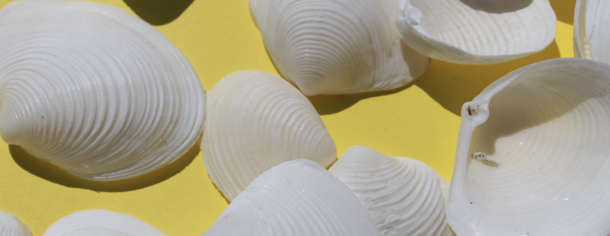

# Albert and the Ear Shells

## Introduction
Ear shells are marine snails, and their age is traditionally determined by counting growth rings after cutting and staining the shell—a tedious process. Albert, a scientist specializing in ear shells, seeks a more efficient way to predict the age (number of rings) of ear shells using readily available measurements.

## Project Overview
- **Goal**: Develop a model to predict the number of rings (age) of ear shells based on easily measurable attributes.
- **Dataset**: Collected measurements on ear shells such as weight, diameter, and length, with rings serving as the target variable.

## Steps
1. **Data Understanding**:
   - Analyzed the features influencing the price of ear shells.
   - Investigated correlations between the attributes and price.
2. **Modeling**:
   - Used machine learning to predict the number of rings based on other attributes.
   - Evaluated the model using metrics like RMSE to understand its accuracy.

## Findings (Conclusion)
- **Price Insights**:
  - There is a strong positive correlation between the weight and price of ear shells, with heavier shells generally commanding higher prices.
  - The diameter and length also influence price, though to a lesser extent than weight.
  - The pricing of ear shells appears to be multifaceted, with multiple attributes affecting the overall price.
- **Prediction Model**:
  - The RandomForestRegressor model was used to predict the number of rings.
  - The model performed reasonably well with a Root Mean Squared Error (RMSE) of 1.1129 on the test data. This indicates that the model's predictions deviate by about 1.11 rings from the true number on average.
- **Conclusion**:
  - The findings suggest that predicting the number of rings in ear shells using readily available measurements is feasible. While the model shows good accuracy, there is room for improvement, particularly in handling potential outliers and further refining the model to reduce prediction errors.

## Future Work
- Explore more complex models or feature engineering to improve prediction accuracy.
- Handle outliers more effectively to improve the model's robustness.

